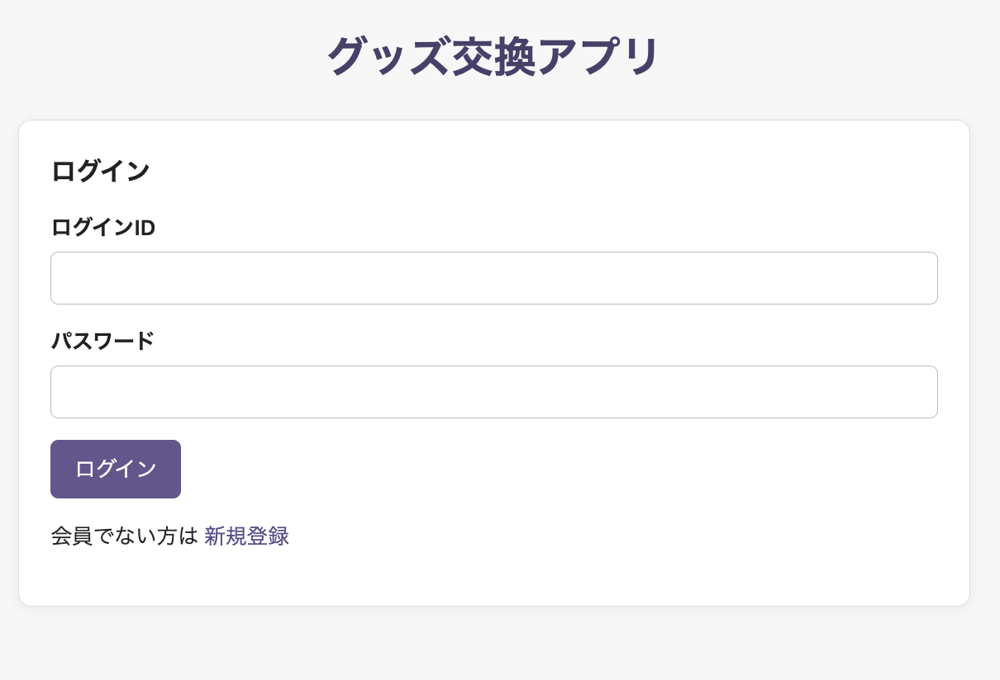
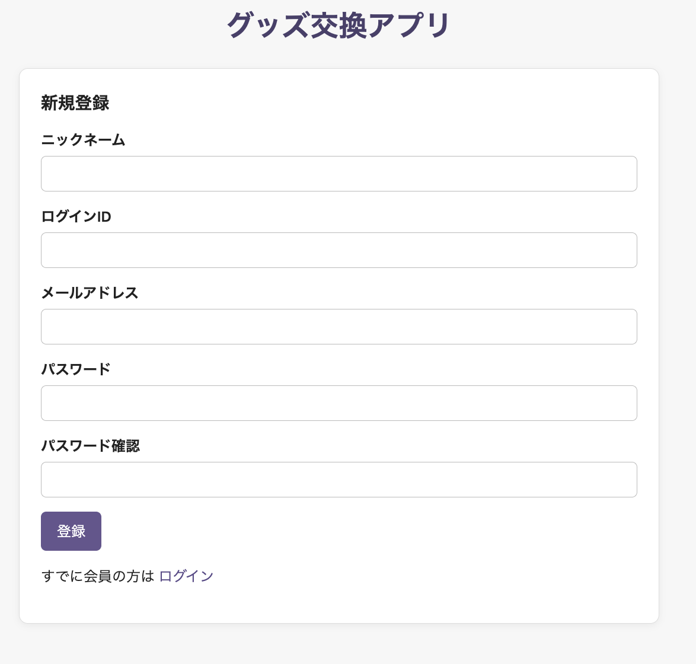
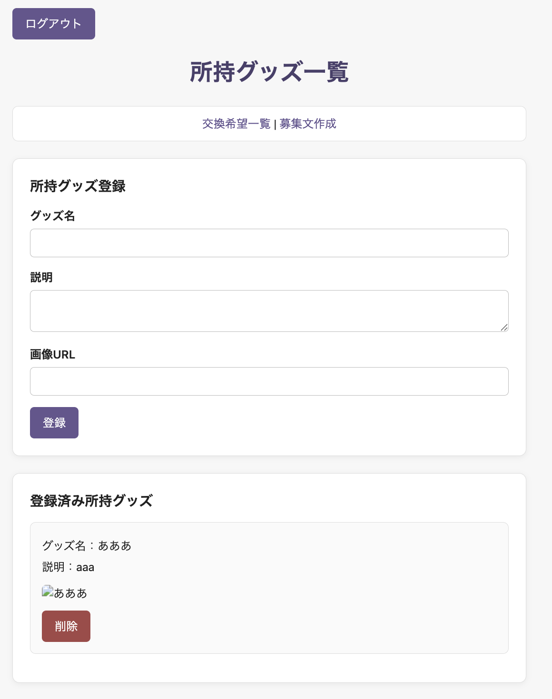
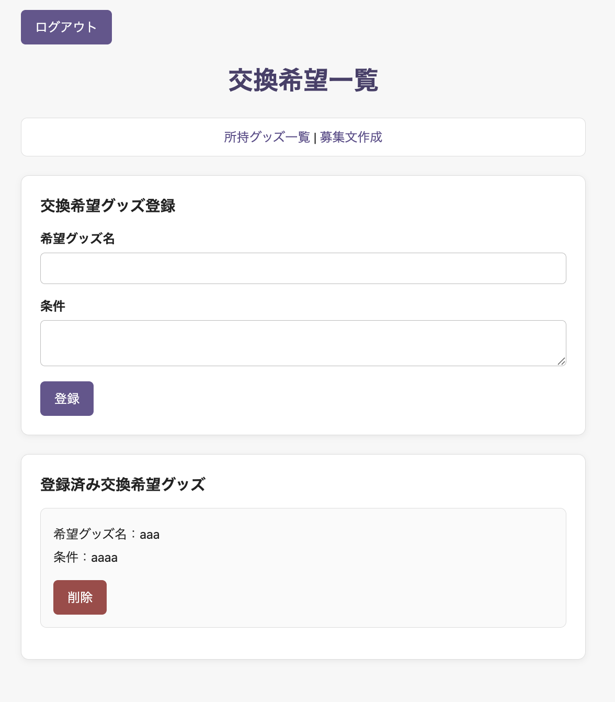
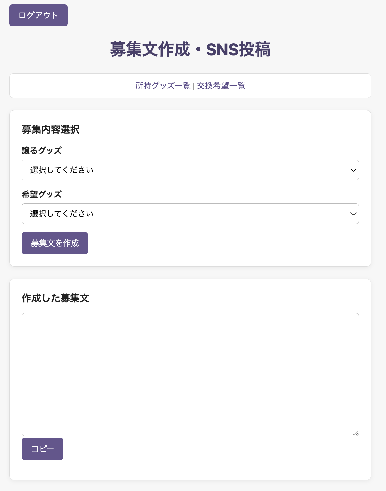
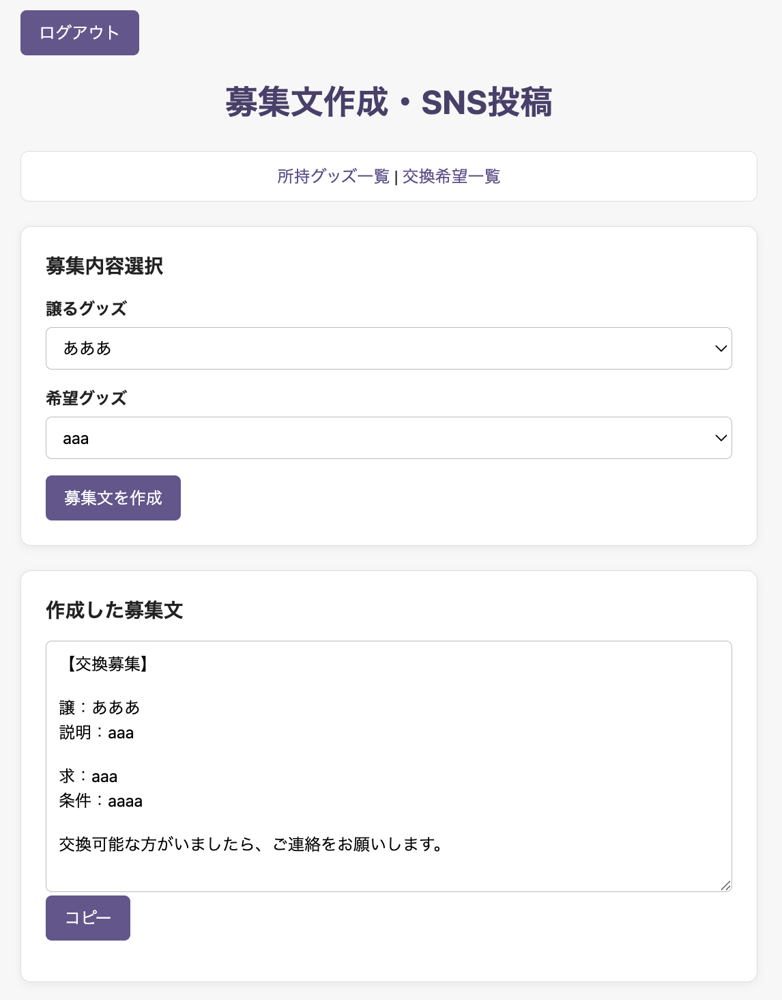
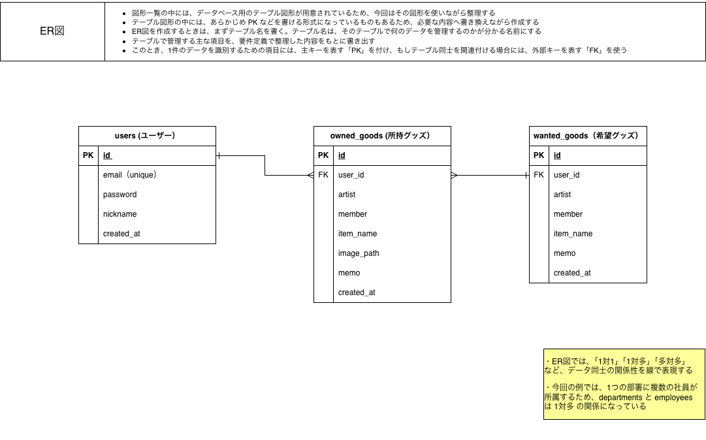

# Fav Exchange

推しグッズの所持情報と交換希望をまとめて管理し、  
SNSに掲載する交換募集文を簡単に作成できるWebアプリケーションです。

---

## アプリケーション概要

Fav Exchangeは、推しグッズの交換を行う際に必要となる情報を一元管理するためのWebアプリケーションです。

所持しているグッズと交換を希望するグッズを登録し、それぞれの情報を組み合わせてSNS投稿用の交換募集文を作成できます。

---

## 主な機能

- 会員登録
- ログイン
- 所持グッズの一覧表示
- 所持グッズの登録
- 所持グッズの削除
- 交換希望グッズの一覧表示
- 交換希望グッズの登録
- 交換希望グッズの削除
- 交換募集文の作成
- 募集文のクリップボードへのコピー
- ログアウト

---

## アプリケーションURL

### フロントエンド

https://fav-exchange.vercel.app

### バックエンドAPI

https://fav-exchange-backend.onrender.com

※無料環境を使用しているため、初回アクセス時に起動まで時間がかかる場合があります。  
※本番環境が停止している場合でも、以下の手順でローカル環境から実行できます。

---

## 画面イメージ

### ログイン画面



### 会員登録画面



### 所持グッズ一覧画面



### 交換希望一覧画面



### 募集文作成画面




---

## 開発背景

推しグッズの交換では、SNSを利用して交換相手を募集することが多くあります。

しかし、所持しているグッズや希望しているグッズを個別に管理し、毎回SNS投稿用の文章を作成することは手間がかかります。

そこで、所持グッズと交換希望グッズを登録・管理し、登録した情報から交換募集文を作成できるアプリケーションを開発しました。

---

## 画面構成

| 画面 | URL | 内容 |
|---|---|---|
| ログイン画面 | `/login` | ログインIDとパスワードを使用してログインします |
| 会員登録画面 | `/register` | 新しい利用者情報を登録します |
| 所持グッズ一覧画面 | `/goods` | 所持グッズの登録・一覧表示・削除を行います |
| 交換希望一覧画面 | `/wanted` | 交換希望グッズの登録・一覧表示・削除を行います |
| 募集文作成画面 | `/post` | 所持グッズと希望グッズから募集文を作成します |

---

## API一覧

| API | HTTPメソッド | 内容 |
|---|---|---|
| `/api/login` | POST | ログインIDとパスワードを確認します |
| `/api/register` | POST | 利用者情報を登録します |
| `/api/goods` | GET | 所持グッズ一覧を取得します |
| `/api/goods` | POST | 所持グッズを登録します |
| `/api/goods/{id}` | DELETE | 指定した所持グッズを削除します |
| `/api/wanted` | GET | 交換希望グッズ一覧を取得します |
| `/api/wanted` | POST | 交換希望グッズを登録します |
| `/api/wanted/{id}` | DELETE | 指定した交換希望グッズを削除します |

募集文は、所持グッズAPIと交換希望APIから取得した情報を使用して、フロントエンド内で生成します。

---

## 使用技術

### フロントエンド

- React
- TypeScript
- Vite
- React Router
- CSS

### バックエンド

- Java 21
- Spring Boot 3.5.16
- Spring Web
- Spring Data JPA
- Maven

### データベース

- MySQL 8.0
- Aiven MySQL

### インフラ・開発環境

- Docker
- Docker Compose
- Render
- Vercel
- IntelliJ IDEA
- Git
- GitHub

---

## ER図



本アプリケーションでは、次の3テーブルを使用しています。

- `users`
- `owned_goods`
- `wanted_goods`

`users`と`owned_goods`、`users`と`wanted_goods`は、それぞれ1対多の関係です。

---

## インフラ構成

```text
利用者のブラウザ
        │
        ▼
Vercel
React / TypeScript
        │
        ▼
Render
Spring Boot / Java
        │
        ▼
Aiven
MySQL

ローカル環境では、Docker Composeを使用してMySQLコンテナを起動します。
```

## ディレクトリ構成
```text
fav-exchange/
├── backend/
│   ├── src/
│   │   └── main/
│   │       ├── java/
│   │       └── resources/
│   ├── Dockerfile
│   ├── pom.xml
│   └── mvnw
├── frontend/
│   ├── src/
│   │   ├── api/
│   │   ├── components/
│   │   └── pages/
│   ├── package.json
│   ├── vite.config.ts
│   └── vercel.json
├── docs/
│   └── images/
├── compose.yaml
├── README.md
└── report.md
```

## ローカル環境での起動方法

前提環境
* Java 21
* Node.js
* npm
* Docker Desktop

１.リポジトリを取得
```text
</> Bash
git clone http://github.com/ichikw/fav-exchange.git
cd fav-exchange
```
２．MySQLを起動
```text
</> Bash
docker compose up -d
```
起動状況を確認します。
```text
</> Bash
docker compose ps
```
３.バックエンドを起動
```text
</> Bash
cd backend
export JAVA_HOME=$(/usr/libexec/java_home -v 21)
./mvnw spring-boot:run
```
　バックエンドは以下で起動します。
```text
http://localhost:8080
```
４.フロントエンドを起動
別のターミナルを開きます。
```text
</> Bash
cd frontend
npm install
npm run dev
```
フロントエンドは以下で起動します。
```text
http://localhost:5173
```

## 動作確認内容
以下の動作を確認しました。
* 会員登録ができる
* 登録した利用者情報でログインできる
* ログイン失敗時にエラーメッセージが表示される
* 所持グッズを登録できる
* 所持グッズ一覧を取得できる
* 所持グッズを削除できる
* 交換希望グッズを登録できる
* 交換希望グッズ一覧を取得できる
* 交換希望グッズを削除できる
* 所持グッズと交換希望グッズから募集文を作成できる
* 作成した募集文をコピーできる
* ログアウトしてログイン画面へ戻れる

## 工夫した点
* 設計書の画面構成とAPI仕様を合わせて、必要な機能に絞って実装しました。
* 所持グッズと交換希望グッズを別々に管理できる構成にしました。
* 登録した情報を選択するだけでSNS投稿用の募集文を作成できるようにしました。
* フロントエンドとバックエンドを分離し、REST APIを使用して通信する構成にしました。
* Docker Composeを使用し、ローカル環境でMySQLを簡単に起動できるようにしました。

## 今後の改善点
* パスワードのハッシュ化
* Spring Securityを使用した認証
* JWTなどを使用したログイン状態の管理
* 利用者ごとのデータ表示
* 画像ファイルのアップロード
* 所持グッズ、交換希望グッズの編集機能
* 入力値チェックの強化
* SNS共有機能
* データベースマイグレーションの導入

## 実装報告
詳しい実装内容と動作確認結果は以下にまとめています。

[実装報告書はこちら](./report.md)

## 画像の保管場所
```text
docs/images/login.png
docs/images/register.png
docs/images/goods.png
docs/images/wanted.png
docs/images/post.png
docs/images/post_2.png
docs/images/er-diagram.png
```

## 本番環境について

本番環境へのデプロイは継続して進めていますが、提出時点ではデプロイ環境の調整を継続しています。

アプリケーションの構成や実装内容が確認できるようREADMEおよび実装報告書に画面キャプチャ、ER図、システム構成、実装内容を掲載しています。
